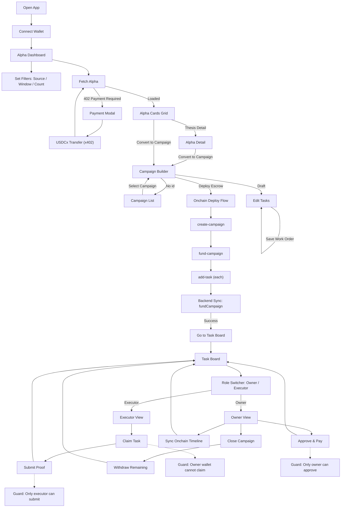

# ThesisRail

ThesisRail is a decentralized content campaign platform built on the Stacks blockchain. It aggregates alpha signals from social media (Reddit, YouTube), converts them into structured content campaigns, and uses a Clarity smart contract escrow to enforce milestone-based payouts to content contributors.

Built for DoraHacks hackathon — combining x402 pay-per-request APIs, Stacks on-chain escrow, and AI-scored signal ingestion.

---

## Architecture Overview

```
+-------------------+         +----------------------+         +---------------------------+
|   Next.js         |         |   Express API         |         |   Stacks Blockchain        |
|   Frontend        | <-----> |   Backend (Node.js)   | <-----> |   thesis-rail-escrow.clar  |
|   (port 3000)     |  HTTP   |   (port 3001)         |  RPC    |   (Clarity 4 / Epoch 3.4)  |
+-------------------+         +----------------------+         +---------------------------+
         |                            |
         |                    +-------+-------+
         |                    |               |
         v                    v               v
   Hiro Wallet           Reddit API     YouTube Data API
   (Stacks)              ingestion      ingestion
```

---

## Project Structure

```
ThesisRail/
  frontend/          Next.js frontend: alpha dashboard, campaign viewer, task management
    src/screens/     Screen modules (alpha, campaign, tasks)
  backend/
    src/             Express API server
      api/           Route handlers (alpha, campaigns)
      ingestion/     Reddit and YouTube data fetchers
      scoring/       Alpha signal scorer (produces alpha cards)
      storage/       File-backed persistent store for campaigns, cards, and events
      onchain/       Stacks tx API client + reconciliation worker
      x402/          Payment middleware (HTTP 402 enforcement)
    contracts/       Clarity smart contract + Clarinet config
      contracts/     thesis-rail-escrow.clar
      tests/         Clarinet unit tests
      settings/      Network configs (Devnet, Testnet, Mainnet)
      deployments/   Generated deployment plans
```

---

## UI/UX Flow



---

## Smart Contract: thesis-rail-escrow-v7

Deployed on Stacks testnet:
```
ST1ZGGS886YCZHMFXJR1EK61ZP34FNWNSX28M1PMM.thesis-rail-escrow-v7
```

### Public Functions

| Function | Access | Description |
|----------|--------|-------------|
| `create-campaign` | Any | Creates a campaign with `(owner, token?, metadata-hash)` |
| `set-allowed-token` | Deployer (pre-launch) | Pins the allowed SIP-010 token before first campaign |
| `fund-campaign` | Campaign owner | Locks USDCx into escrow (`campaign-id`, `token`, `amount`) |
| `add-task` | Campaign owner | Adds a task with payout and deadline |
| `cancel-task` | Campaign owner | Cancels expired/unclaimed tasks and releases allocation |
| `claim-task` | Any (not owner) | Claims an open task to work on |
| `submit-proof` | Executor | Submits proof hash for review |
| `approve-task` | Campaign owner | Approves proof, releases USDCx payout (`campaign-id`, `task-id`, `token`) |
| `close-campaign` | Campaign owner | Closes campaign |
| `withdraw-remaining` | Campaign owner | Withdraws leftover USDCx (`campaign-id`, `token`, `amount`) |

---

## Getting Started

See individual README files in [`frontend/README.md`](./frontend/README.md) and [`backend/README.md`](./backend/README.md).

### Quick Start (Full Stack)

```bash
# 1. Start backend
cd backend && npm install && npm run dev

# 2. Start frontend
cd frontend && npm install && npm run dev
```

Frontend: http://localhost:3000
Backend API: http://localhost:3001

---

## Deployed Contract

| Network | Address |
|---------|---------|
| Testnet | `ST1ZGGS886YCZHMFXJR1EK61ZP34FNWNSX28M1PMM.thesis-rail-escrow-v7` |
| Explorer | https://explorer.hiro.so/address/ST1ZGGS886YCZHMFXJR1EK61ZP34FNWNSX28M1PMM.thesis-rail-escrow-v7?chain=testnet |

---

## Tech Stack

| Layer | Technology |
|-------|-----------|
| Frontend | Next.js 16, TypeScript, Hiro Wallet SDK |
| Backend | Node.js, Express, TypeScript |
| Smart Contract | Clarity 4, Stacks blockchain (Epoch 3.4) |
| Payment Protocol | x402 (HTTP 402 pay-per-request via USDCx) |
| Data Sources | Reddit API, YouTube Data API v3 |
| Contract Tooling | Clarinet, Vitest |

---

## License

MIT
