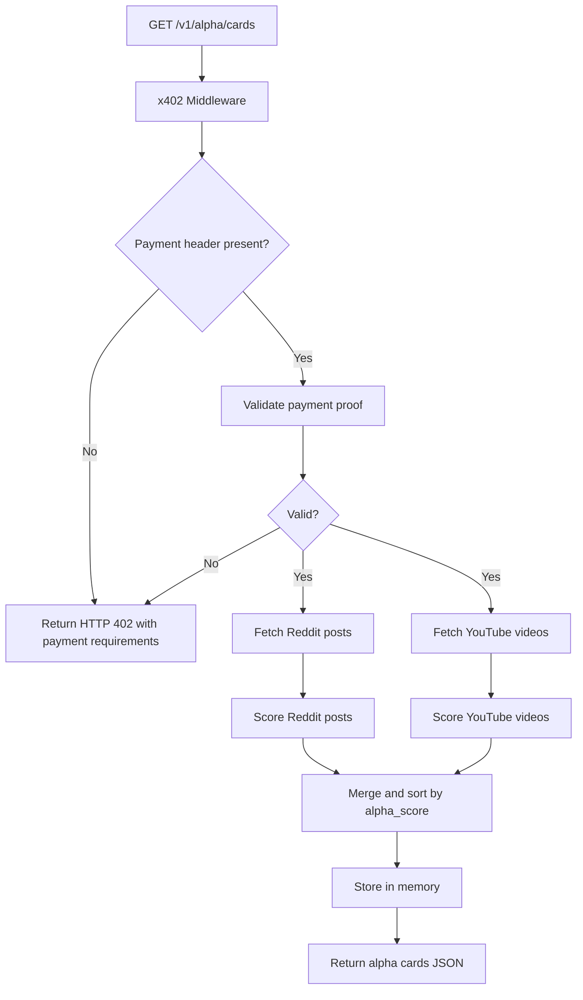
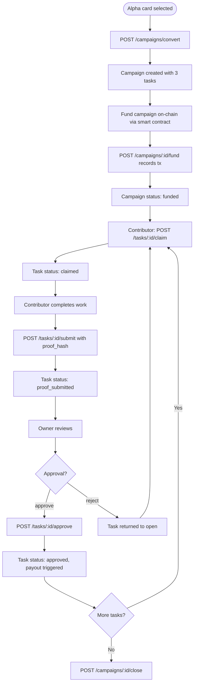

# ThesisRail Backend

Node.js/Express API server for the ThesisRail platform. Provides two main subsystems:

1. **Alpha pipeline** — ingests posts and videos from Reddit and YouTube, scores them into alpha cards, and gates access behind x402 pay-per-request HTTP payments.
2. **Campaign API** — converts alpha cards into structured content campaigns and manages their lifecycle (fund, claim, submit, approve, payout).

---

## API Reference

### Alpha Endpoints

| Method | Path | Auth | Description |
|--------|------|------|-------------|
| GET | `/v1/alpha/cards` | x402 (1 STX) | Fetch scored alpha cards from Reddit and YouTube |
| GET | `/v1/alpha/clusters` | x402 (premium) | Optional clustering view for recent alpha cards |
| GET | `/v1/alpha/creators/breakout` | x402 (premium) | Optional creator breakout rankings |
| GET | `/v1/alpha/cards/:id` | None | Fetch single alpha card by ID |

Query parameters for `GET /v1/alpha/cards`:

| Parameter | Default | Options |
|-----------|---------|---------|
| `source` | `both` | `reddit`, `youtube`, `both` |
| `window` | `24h` | `24h`, `7d` |
| `n` | `20` | `10`, `20`, `50` |

### Campaign Endpoints

| Method | Path | Description |
|--------|------|-------------|
| POST | `/v1/campaigns/convert` | Convert an alpha card into a campaign with 3 tasks |
| GET | `/v1/campaigns` | List all campaigns |
| GET | `/v1/campaigns/:id` | Get campaign detail |
| POST | `/v1/campaigns/:id/fund` | Record campaign as funded |
| POST | `/v1/campaigns/:id/tasks/:taskId/claim` | Claim an open task |
| POST | `/v1/campaigns/:id/tasks/:taskId/submit` | Submit proof for a claimed task |
| POST | `/v1/campaigns/:id/tasks/:taskId/approve` | Approve proof and trigger payout |
| POST | `/v1/campaigns/:id/close` | Close a campaign |
| POST | `/v1/campaigns/:id/withdraw` | Withdraw remaining balance after close |

---

## Alpha Pipeline



---

## Campaign Lifecycle



---

## x402 Protocol

The `GET /v1/alpha/cards` endpoint is gated by the x402 middleware. When a client makes a request without a valid payment proof, the server returns:

```http
HTTP/1.1 402 Payment Required
X-Payment-Required: {...}
```

The client (frontend) reads the `X-Payment-Required` header, presents a payment modal, executes an STX transfer via the Hiro Wallet, and retries the request with the payment proof in the `X-Payment` header.

Pricing logic in this MVP:
- cached cards query (recently requested) -> cheaper
- uncached/premium routes (`clusters`, `creators/breakout`) -> regular premium price

Verification behavior:
- server verifies `txId` on Stacks API (`/extended/v1/tx/:txid`)
- tx must be `token_transfer`, `success`, recipient must match configured receiver, and amount must be >= required amount
- optional demo bypass is disabled by default (`X402_ALLOW_DEMO_PROOF=false`)

---

## Alpha Scoring

Each post or video is scored 0–100 based on heuristics derived from the source content:

| Signal | Weight |
|--------|--------|
| Upvotes / likes relative to baseline | High |
| Engagement velocity (time of post) | High |
| Keyword matching (specific financial/crypto terms) | Medium |
| Content length and structural quality | Low |

Cards with `alpha_score >= 70` are classified as high alpha. Cards `40–69` are medium. Below 40 is low.

---

## Contracts

See [`contracts/README.md`](./contracts/README.md) for smart contract documentation and deployment instructions.

---

## Environment Variables

Copy `.env.example` to `.env` and fill in the values:

```
PORT=3001
REDDIT_CLIENT_ID=your_reddit_client_id
REDDIT_CLIENT_SECRET=your_reddit_client_secret
YOUTUBE_API_KEY=your_youtube_api_key
STACKS_NETWORK=testnet
CONTRACT_ADDRESS=ST1ZGGS886YCZHMFXJR1EK61ZP34FNWNSX28M1PMM
CONTRACT_NAME=thesis-rail-escrow-v4
```

---

## Development

```bash
npm install
npm run dev       # starts ts-node with nodemon on port 3001
npm run build     # compiles to dist/
npm start         # runs compiled dist/index.js
```

Health check: `GET http://localhost:3001/health`
