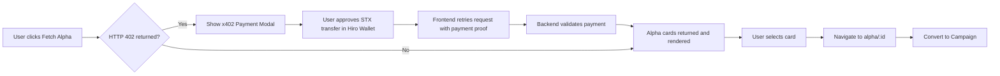

# ThesisRail Frontend

Next.js frontend for the ThesisRail platform. Displays alpha signals fetched from the backend via the x402 pay-per-request protocol, and provides an interface to manage content campaigns and tasks on the Stacks blockchain.

---

## Pages

| Route | Description |
|-------|-------------|
| `/` | Alpha Dashboard — fetch and browse alpha cards |
| `/alpha/:id` | Alpha card detail — view full signal and convert to campaign |
| `/campaign` | Campaign list and detail |
| `/tasks` | Task management for contributors |

`src/screens` contains the UI screen modules used by these routes.

---

## Alpha Signal Flow



---

## Environment Variables

Create `.env.local` in the `frontend/` directory:

```
NEXT_PUBLIC_API_URL=http://localhost:3001
NEXT_PUBLIC_CONTRACT_ADDRESS=ST1ZGGS886YCZHMFXJR1EK61ZP34FNWNSX28M1PMM
NEXT_PUBLIC_CONTRACT_NAME=thesis-rail-escrow-v4
NEXT_PUBLIC_NETWORK=testnet
NEXT_PUBLIC_STACKS_API_URL=https://api.testnet.hiro.so
```

---

## Development

```bash
npm install
npm run dev
```

The dev server runs on http://localhost:3000.

---

## Dependencies

| Package | Purpose |
|---------|---------|
| `next` | App framework |
| `@stacks/connect` | Hiro Wallet integration |
| `@stacks/transactions` | STX transfer and contract calls |
| `@stacks/network` | Stacks network configuration |

---

## Wallet Integration

The frontend uses the Hiro Wallet browser extension via `@stacks/connect`. The `ClientProviders` component wraps the app with the wallet context. Two wallet actions are used:

1. `openSTXTransfer` — sends STX to pay for x402-gated API access
2. `openContractCall` — interacts with the escrow contract (fund, claim, submit, approve)
